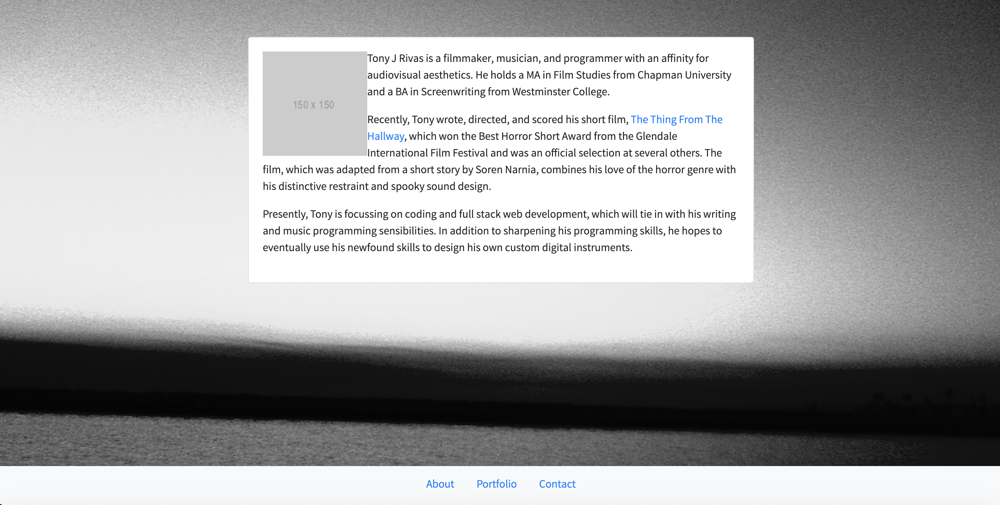
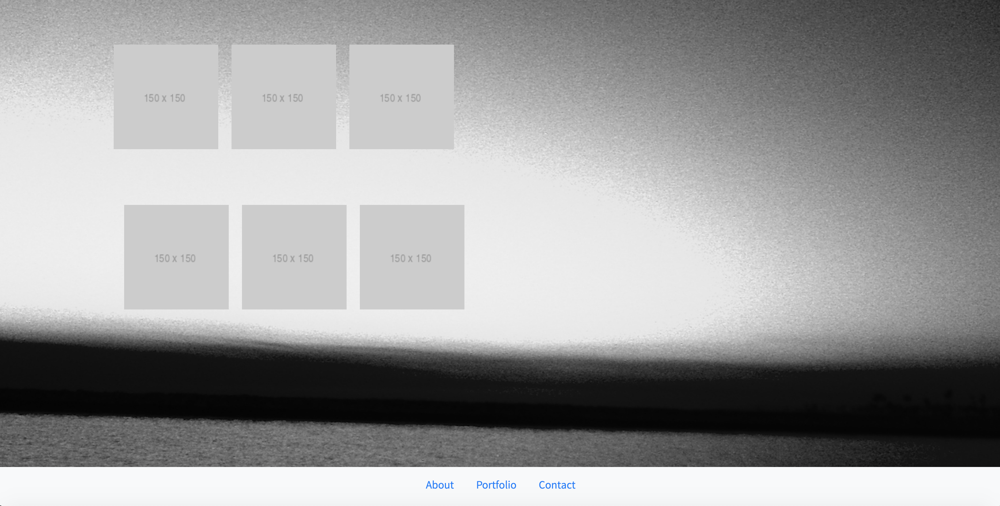
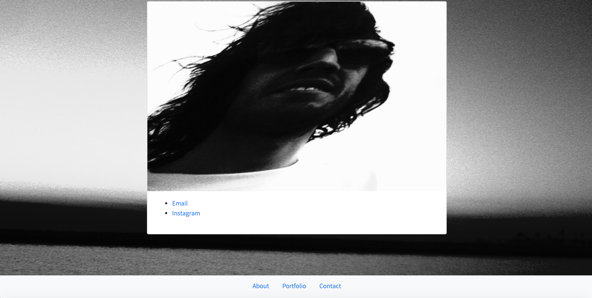

# cynesthete.github.io
My Portfolio

The purpose of this application was to create a portfolio for my coding projects. I built it using a combination of CSS, HTML, and JavaScript in tandem with BootStrap's framework. In terms of design, I wanted something simple and clean that is easy on the eyes but reflects certain milder aspects of my aesthetic preferences.

[Demo Here](https://cynesthete.github.io/)

Authored by Tony Rivas; I watched a [video](https://youtu.be/qmPmwdshCMw) on YouTube to get a better understanding of the Bootstrap Grid, which was made by Academind.
